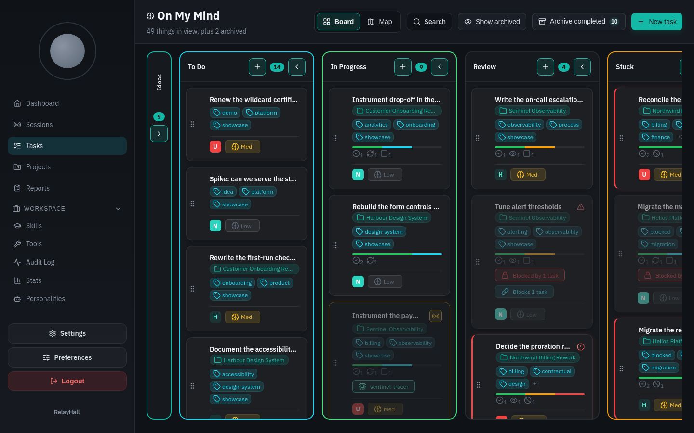
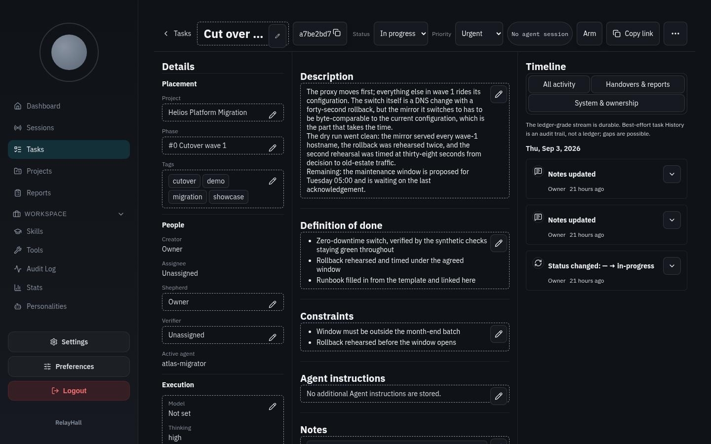
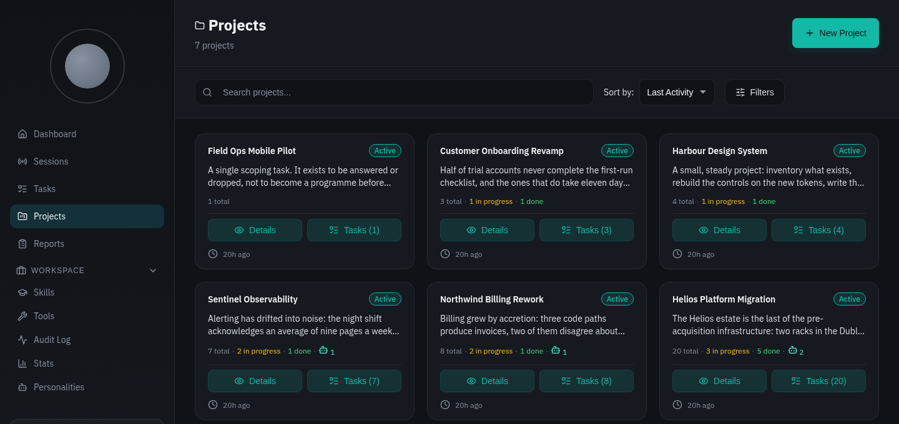
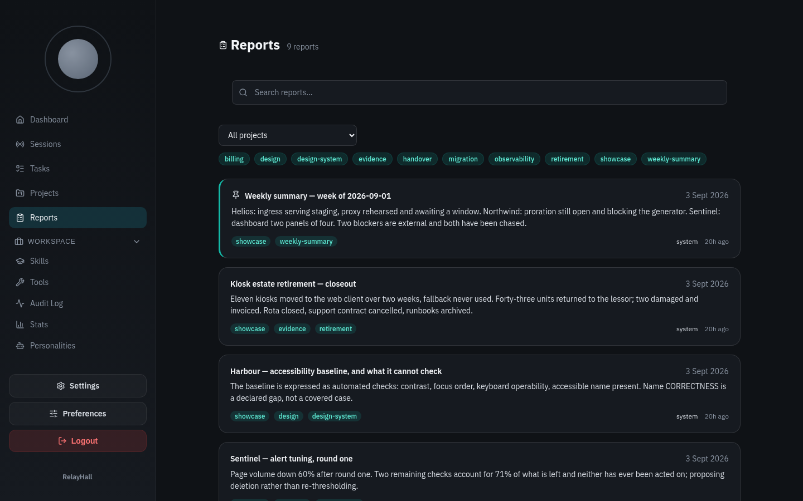
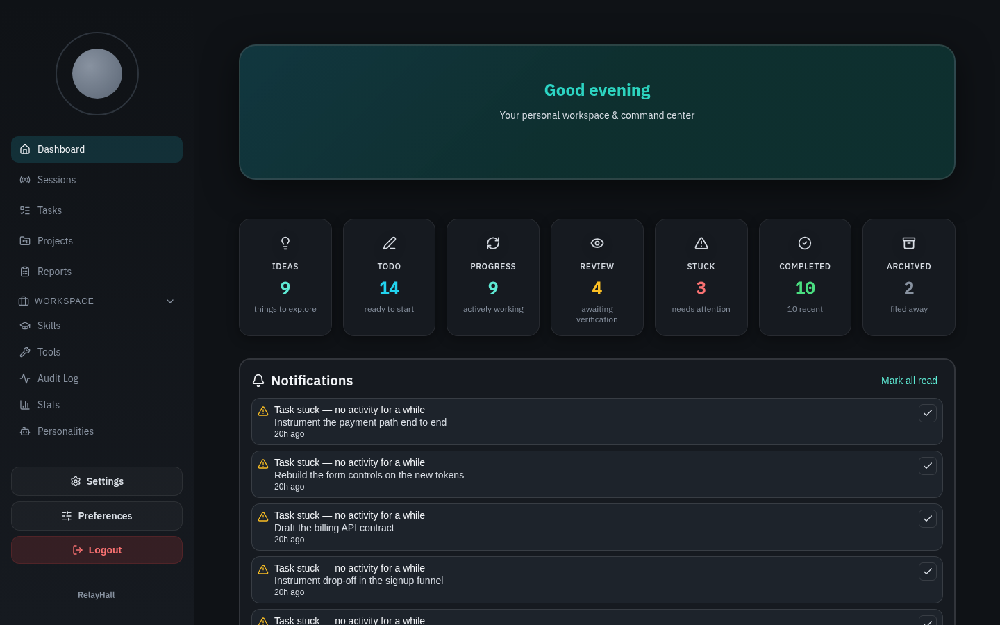
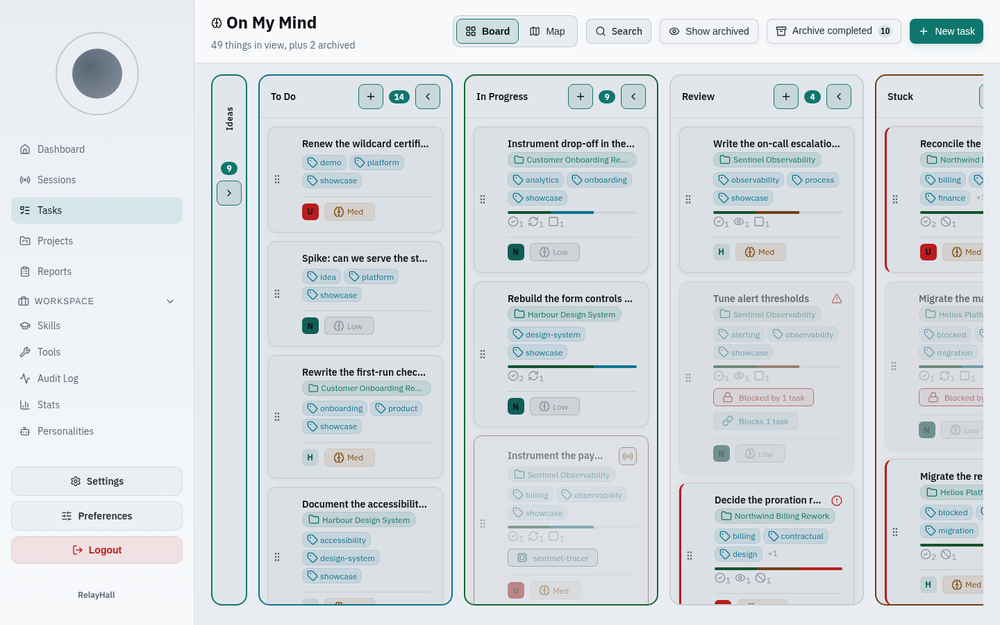
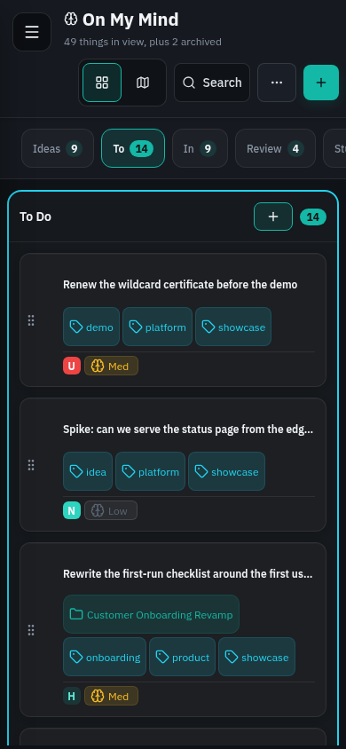
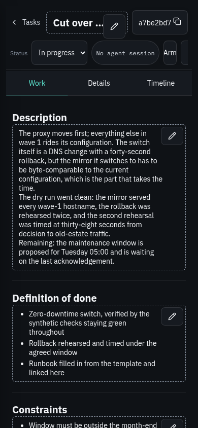
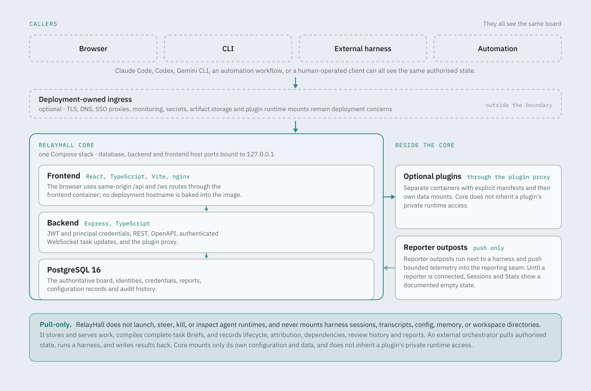

<p align="center">
  
</p>

<h1 align="center">RelayHall</h1>

<p align="center">
  <strong>An open-source board where people and AI agents work the same tasks under governed access.</strong>
</p>

<p align="center">
  <a href="https://github.com/relayhall/relayhall/actions/workflows/ci.yml"></a>
  <a href="LICENSE"></a>
  <a href="https://github.com/relayhall/relayhall/tags"></a>
  <a href="CHANGELOG.md"></a>
</p>

<p align="center">
  
</p>

RelayHall is an MIT-licensed, self-hosted permissioned blackboard. People and
independent AI harnesses use the same board to coordinate work, share durable
reports, discover governed capabilities, and leave reviewable evidence for the
next participant.

It is **not another agent harness**. Models usually work best in the native
harnesses built around them, while vendors, prices, and preferred tools keep
changing. RelayHall keeps the coordination layer stable: Claude Code, Codex,
Gemini CLI, an automation workflow, or a human-operated client can all see the
same authorised state without being forced into one runtime.

> **This is a public beta.** It is in daily use on the deployment it was built
> for, every change passes a gate chain and a non-author review, and the parts
> that are not finished are listed in [What is in this beta](#what-is-in-this-beta)
> rather than implied to be done.

## Status

**Public beta, work in progress.** RelayHall runs every day on the deployment it
was built for. Every change on `main` passes the gate chain and a non-author
review round at the exact commit it landed on. This section says which parts of
the product that sentence covers, and which parts it does not.

**Complete.** The board and its seven-state task lifecycle; Projects, Phases and
typed Resources; Reports, the Brief and the Verifier; identity and authority —
first run, Accounts, scoped revocable credentials, object-level grants, Groups,
Access profiles, Warrants; single sign-on with OpenID Connect, SCIM
provisioning, Invitations and an OAuth 2.1 authorization server; Skills,
Personalities and the Charter; Services, Connectors and versioned capability
descriptors; telemetry ingest with a governed raw store, quarantine and
retention; the knowledge broker's configuration, outbound policy, signing and
sealed handles; the four surfaces in parity — dashboard, CLI, REST with OpenAPI,
and MCP over Streamable HTTP and stdio; the deterministic migration ledger with
fresh-install replay proofs.

**Available for review, and being refined.** These landed inside the beta window
and are real, usable and gated — they are simply younger than the rest, so
expect them to move:

- **Blueprints and the capture flow** — save a Phase as a Blueprint, placeholder
  toggles in the task editor, the tile registry, one-form use, portable
  references with access warnings. Review rounds are still owed on parts of the
  engine.
- **The living Map** — one continuous plane with size-truthful containers and
  Horizontal, Vertical and Organic organizations. Landed in two passes at the
  end of the beta window; layout at large scale is a known open area.
- **The Create identity wizard** — one flow for Human, Service and Agent
  identities, with the credential shown once. The role descriptions and some
  copy are still being unified.
- **UI polish** — consistent Project fields, contained edit controls, themed
  forms, a sticky header, restrained motion and truthful loading states. One
  convention decision is still open.
- **Personality versions** — immutable versions so a Blueprint reference stays
  stable. A second review round is owed.

**Planned, and not in this release.** The three lenses interface for delegated
group administration; outbound telemetry export and OTLP receivers; the
knowledge broker's federated fan-out query; the messaging gateway; Map hover
linking, a resizable split and a project grouping layer; the settings matrix
follow-on. The full list, with the identifier tracking each item, is in
[What is in this beta](#what-is-in-this-beta) and in
[CHANGELOG.md](CHANGELOG.md).

**Found a problem?** Open an issue at
[github.com/relayhall/relayhall/issues](https://github.com/relayhall/relayhall/issues)
with your release or commit, what you expected and what happened — and for
anything security-relevant use the private advisory route in
[SECURITY.md](SECURITY.md) instead of a public issue.

## Why RelayHall

Useful assistance needs both **context** and **capability**. A generic harness
becomes productive when it can discover the relevant projects, tasks,
reports, identities, and approved skills without being reconfigured from scratch
for every session.

RelayHall provides that narrow waist:

- one governed source of truth across heterogeneous harnesses;
- durable handovers instead of runtime-specific session continuity;
- principal-bound credentials and explicit review evidence;
- deployment-owned extension points rather than a universal built-in toolset;
- a human-readable overview of what is planned, active, stuck, and verified.

Harnesses do not talk to each other. **They all see the same board.**

## Screens

Captured from a demonstration deployment carrying showcase data only, with
default RelayHall branding: no deployment name, logo, accent or copy override.

| | |
|---|---|
|  |  |
| **Task** — one object carrying placement, people, execution settings, evidence and its own history. | **Projects** — each with a Charter, Phases, typed resources and its own task counts. |
|  |  |
| **Reports** — durable handovers and evidence, tagged and searchable. | **Overview** — what is planned, active, stuck and verified, at a glance. |

The board also renders in the Relay Light Theme and on a phone:

<p align="center">
  
  
  
</p>

## Product boundary and non-goals

Three properties are protected:

1. **Pull-only core.** RelayHall does not launch, steer, kill, or inspect agent
   runtimes. An external orchestrator pulls authorised state, runs a harness,
   and writes results back.
2. **Identity and grants remain core.** Authority belongs to server-verified
   principals and credentials, not caller-written attribution fields.
3. **Skills are governed distribution.** Capability instructions belong in a
   curated, versioned standard format rather than drifting independently in
   every harness.

RelayHall deliberately does **not** aim to be:

- a hosted SaaS;
- an all-purpose “life OS” with every feature in core;
- a Microsoft-gravity enterprise suite;
- a model gateway, agent runtime, workflow engine, reverse proxy, artifact
  store, secret manager, or knowledge base;
- a system that silently reads host workspaces, transcripts, process state, or
  harness configuration.

Those capabilities may be connected as deployment-owned services or plugins
with their own credentials and security boundaries.

## What ships in the core

- Kanban tasks with subtasks, dependencies, priorities, Assignees, and
  explicit review gates
- Projects with links and structured resource references
- Durable reports for handover and evidence
- Accounts for people and services, and the Connectors and Agents that hold
  the scoped, revocable `rh_` credentials — an Account itself holds none:
  people act through login sessions and a service Account through its
  Connectors
- Personality and skills registries
- Brief compilation for external harnesses
- Authenticated REST/OpenAPI and WebSocket surfaces
- Sessions and Stats as always-on surfaces that render a documented empty
  state: no reporter ships in core, and the board never reads harness state
- PostgreSQL migrations, backup/restore helpers, and a self-contained Compose
  deployment

Optional journals, content pipelines, image generation, knowledge interfaces,
and harness observers belong outside the core.

## Terminology

RelayHall calls the board object a **task** in public prose, and the REST
paths, database schema, and CLI use the same word: `/tasks`, `<task-id>`, and
friends. The capitalised **MCP Tasks extension** is a separate protocol term,
always written in full. See [docs/terminology.md](docs/terminology.md).

## Quick start

### Requirements

- Linux host with Docker Engine
- Docker Compose v2.20 or newer
- OpenSSL
- Git
- 2 GB RAM and one CPU core for a small installation

### Install

```bash
git clone https://github.com/relayhall/relayhall.git
cd relayhall
./setup.sh
docker compose config --quiet
docker compose up -d --build --wait
```

`./setup.sh` writes `.env` and generates the database password and the signing
secret. It also asks for a break-glass dashboard password: it is read without
echo, hashed immediately, and only the **hash** is written into `.env` — the
plaintext is passed to the hashing container as an environment variable and is
never persisted by the script.

Then open <http://localhost:8082/dashboard/>. Because the deployment has no
administrator yet, the sign-in screen offers **Create the first administrator**:
choose a handle, a display name and a password. That creates your own
administrator Account, signs you in as it, and records the act in the audit log.
The step is offered only while no administrator exists — once one does, it is
gone, and a second attempt is refused.

A fresh installation contains no tasks, projects, reports, agents, external
integrations, credentials, or legacy access grants. It includes five built-in
Personalities, five starter Skills, the reserved in-process board knowledge
source, and the core access catalogue. The bootstrap and internal automation
actors are infrastructure, not preconfigured user accounts. No access bundle is
assigned to anyone until configured. First administrator creation adds your
Account and its login/audit records.

**That Account is the way in.** The break-glass password stays available for the
day you lock yourself out; using it while an administrator exists is audited and
says so on screen.

> **Open it at `localhost`, or put TLS in front first.** The login session is
> carried by a `Secure` cookie, which a browser stores only from a trustworthy
> origin. `http://localhost:8082` is one. The same deployment reached over
> plain HTTP at a LAN address or hostname is not, and the administrator you
> just created will not be able to sign in there — only the deployment
> password will. [DEPLOYMENT.md](DEPLOYMENT.md) covers putting TLS in front.

Single sign-on is optional and comes later: connect an identity provider when
you want one, as described in [docs/oauth.md](docs/oauth.md) and
[docs/principals.md](docs/principals.md). A deployment with no identity provider
configured is a complete deployment.

### Verify

```bash
docker compose ps
curl --fail http://localhost:8082/health
curl --fail http://localhost:8082/api/health
```

All three services should report healthy. The browser uses same-origin `/api`
and `/ws` routes through the frontend container; no deployment hostname is
baked into the image.

### Stop or remove

```bash
docker compose down             # keep database data
docker compose down --volumes   # destructive: also remove database data
```

See [docs/getting-started.md](docs/getting-started.md) for the manual setup path
and [DEPLOYMENT.md](DEPLOYMENT.md) before putting RelayHall behind an ingress.

## Architecture

<p align="center">
  <picture>
    <source media="(prefers-color-scheme: dark)" srcset="docs/brand/architecture.svg">
    
  </picture>
</p>

The default Compose stack binds database, backend, and frontend host ports to
`127.0.0.1`. TLS, DNS, SSO proxies, monitoring, secrets, artifact storage, and
plugin runtime mounts remain deployment concerns.

Core mounts only its own configuration and data. A reporter **outpost** — which
is not a plugin, and runs beside someone else's agent runtime rather than inside
this deployment — may observe a harness locally and push bounded telemetry, but
core never receives host-level runtime authority.

## What is in this beta

Integrated, gated, and running:

- **The board** — Tasks with Subtasks, dependencies, priorities, Assignees and
  an explicit review lifecycle; Projects with a Charter, Phases and typed
  Resources; durable Reports.
- **Identity and authority** — a first-run step that creates the deployment's
  first administrator Account, with the dashboard password kept as audited
  break-glass; Accounts and scoped, revocable credentials; object-level grants;
  Access profiles; a Task's visibility inherited from its Project.
- **Surfaces** — the dashboard, the bundled `relayhall` CLI, REST with OpenAPI,
  an authenticated WebSocket feed, signed webhook delivery, and an MCP server
  over both Streamable HTTP and stdio, generated from a single registry of
  MCP Tools so the two transports cannot drift.
- **Blueprints** — portable, versioned plans with a draft, review and
  published lifecycle: save a Phase as a Blueprint, use one in a single
  form, carry placeholders into the task editor, and instantiate under a
  separate Warrant-bound setup with its own ledger.
- **The living Map** — one continuous, size-truthful plane showing Projects,
  Phases, tasks and their dependencies, in Horizontal, Vertical and Organic
  organizations with a fit-all zoom floor.
- **Registries** — Skills, Personalities, and the Service registry with
  Connectors and versioned capability descriptors.
- **Reliability** — an idempotency contract for mutating MCP Tools. Once a call
  is recorded, an exact retry under the same key returns the original result;
  the same key with a different request is always refused; and Agent minting
  refuses a repeated key rather than replaying, because the one-time pack is
  never stored. If the record itself cannot be written the call fails closed and
  says so — the act may have landed while the token did not, and the answer
  tells the caller to re-read and retry with a new token rather than pretending
  the contract held.
- **Telemetry ingest** — reporter outposts push bounded frames into the
  reporting seam under a declared policy, with retention and quarantine,
  and the Sessions and Stats screens render the presence projection built
  from them.
- **Operations** — a deterministic migration ledger with fresh-install replay
  proofs, backup and restore helpers, a side-effect-free boot check, and the
  Compose deployment.

### Known limitations

Named here rather than discovered later. Each is scheduled, not abandoned.

- **Availability under load.** Several hardening items are open against
  behaviour that only appears under concurrent load: connection-pool pressure
  answering an authorization read with a server error, and a task list that
  returns the whole deployment in one response instead of paging. A beta
  deployment is comfortable at a few thousand tasks and has been measured
  there; it has not been proven at ten times that.
- **The Map at scale.** The relationship map is now one continuous,
  size-truthful plane with Horizontal, Vertical and Organic organizations. The
  organic layout is the newest part of the product and its behaviour on very
  large deployments is an open area, with its own tracked items.
- **Blueprints have review rounds owed.** The Blueprint engine, its lifecycle
  and Phase capture are built, gated and in use. Some review rounds on the
  engine and on Personality versions close before the release candidate, not
  before this tag.
- **Telemetry stops at ingest.** Frames that reporters push in are stored,
  governed and retained, and the Sessions and Stats screens render the presence
  projection built from them. Forwarding frames onward to an external
  observability system, and receiving OpenTelemetry directly, are not part of
  this release.
- **The knowledge broker has no fan-out query.** Knowledge configuration, the
  outbound address policy, the assertion signer, published verification keys and
  sealed handles all ship. The federated fan-out query that uses them does not.
- **Group administration is administered centrally.** Groups, grants and Access
  profiles are administered by the deployment's own authority, and directory
  groups arrive over SCIM with a remote-group catalogue. The member, manager and
  admin lenses — delegated group stewardship — are designed and deliberately
  deferred.
- **Non-escalation is a rule, not yet an arm.** That an administrator cannot
  grant authority they do not themselves hold is enforced by the owner plane and
  by review; the automatic enforced arm on grants, groups and Access profiles is
  post-v1.
- **Controls narrower than the properties they name.** A substantial set of open
  items records a gate or test that could pass while the property it guards is
  broken — a census that a determined author could step around, an assertion
  that measures less than it claims. These are control strength, not known
  product defects, and they are the substance of the hardening walkthrough that
  gates the release candidate.
- **Signing in as an Account needs HTTPS, or `localhost`.** The login session
  is carried by a `Secure` cookie, so a browser stores it only from a
  trustworthy origin. `http://localhost:8082` counts as one and the quick
  start works. The same deployment reached over plain HTTP at a LAN address
  or hostname does not: first run will create the administrator Account, and
  that Account will not be able to sign in — only the deployment password
  will. Put TLS in front before anyone but you uses it, as
  [DEPLOYMENT.md](DEPLOYMENT.md) says.
- **No formal external accessibility audit.** The interface is built and gated
  to WCAG 2.2 AA, with automated checks in CI and every screen walked by hand;
  an independent audit is not part of v1.

Every limitation above is tracked, and the release notes in
[CHANGELOG.md](CHANGELOG.md) carry the identifier of the item tracking each one.
## Using an external harness

Give each client its own narrow credential. The CLI ships in the repository at
`cli/relayhall` (Python 3 — no install step): run it as `./cli/relayhall`, or
put `cli/` on your `PATH` to call it as `relayhall`. Point it at your
deployment with `--api http://<host>:<backend-port>` or the
`RELAYHALL_API_URL` environment variable (default `http://localhost:3001`),
then authenticate once with `relayhall login` — the token is cached at
`~/.config/relayhall/token.json` (override the directory with
`RELAYHALL_CONFIG_DIR`) and picked up automatically; `--token` and
`RELAYHALL_TOKEN` take precedence over the cache.

A typical pull loop is:

```bash
relayhall next
relayhall get <task-id>
relayhall brief <task-id>
# Run the chosen external harness.
# Update the task and attach a report containing evidence.
```

`relayhall` is the CLI command. The estate-era entry point was removed with the

Capture existing work with `relayhall blueprint capture --phase <phase-uuid> --name "Reusable work"`. This saves a draft for independent review. See [Authoring and using Blueprints](docs/blueprints/README.md).

vocabulary purge (D-9: no compatibility aliases).

Compiling a task Brief is a disclosure act gated by `tasks:read` (the former
`tasks:prompt` scope retired into it). `POST /tasks/{id}/brief` produces text;
it does not execute anything. The pre-A7 `/tasks/{id}/prompt` and
`/tasks/{id}/spawn-prompt` spellings were removed in Phase 3, not aliased.

The current foundation exposes REST/OpenAPI, compare-and-set claim/lease routes,
the bundled CLI, and an authenticated MCP surface served **in-process** —
Streamable HTTP at `/mcp` plus a stdio entry, both generated from one tool
registry, so the two transports cannot drift. Its toolset covers Tasks, claim
and lease, Briefs, Reports, Projects, Phases, the agent plane, and read-only
introspection of the capability and identity planes; personality and principal
*mutation* was deliberately removed from it. The cursor event feed and signed
webhook delivery have shipped — over REST and the delivery worker — and the
feed and webhook CRUD are precisely what is deliberately left off MCP. See
[MCP server](docs/mcp.md).

## Plugins and reporters

Plugins are separate services registered through `relayhall.plugins.json` and
installed **into the board deployment**: own container, manifest, proxy route.
They own their private mounts, credentials, media policy, and lifecycle.

Outposts are the other half, and they are not plugins. An outpost is a reporter
that runs **beside someone else's agent runtime** and pushes session/activity
frames into RelayHall instead of granting core read access to runtime state.
Different trust model, different install story — the distinction is the trust
boundary.

- [Plugin development](docs/plugin-development.md)
- [Observability boundary](docs/observability.md)
- [Deployment seams](docs/seams.md)

## Operations

```bash
./database/backup.sh
./database/restore.sh ./backups/relayhall_YYYYMMDD_HHMMSS.sql.gz
```

Backups are written outside the database volume. Test restore procedures on a
disposable deployment before relying on them for production recovery.

## Development and CI

Identical workflows under `.gitea/workflows/` and `.github/workflows/` keep the
private working repository and public promotion target on the same gates.

CI runs in **two tiers**. `ci.yml` — the **fast tier** — runs on every push and
every pull request: the repository and deployment contract, type checking, the
mocked backend suite, the frontend build and unit tests, the accessibility smoke
set, and the CLI tests. `ci-full.yml` — the **full tier** — runs on demand and
carries every gate that needs a real PostgreSQL, every mutation drill and every
red-proof control. A shape gate requires each gate step to appear exactly once
across the two workflows, so a gate cannot be dropped, and cannot be quietly
duplicated into both tiers either. [docs/ci.md](docs/ci.md) lists every job,
the local command that reproduces it, and how to ask for a full run.

The main compile and test checks, as run locally:

```bash
(cd backend && npm ci && npx tsc --noEmit && npx jest --silent)
(cd frontend && npm ci && npx tsc --noEmit && npx vite build && npm run test:unit)
(cd cli && python3 -m pytest -q)
bash -n setup.sh database/backup.sh database/restore.sh backend/entrypoint.sh
docker compose config --quiet
```

A direct backend boot check runs in boot-check mode
(`RELAYHALL_BOOT_CHECK=1`): the server constructs its routes, binds the port,
reports, and exits on its own — exit `0` is a pass, anything else is a
failure. In this mode the database pool is pinned to an unreachable endpoint
at construction, no background job starts, and no webhook is dispatched, so
the check is side-effect free even if the environment carries live database
credentials. Never run the boot check without `RELAYHALL_BOOT_CHECK=1`.

```bash
(cd backend && RELAYHALL_BOOT_CHECK=1 JWT_SECRET="$(openssl rand -hex 64)" PORT=3999 ./node_modules/.bin/tsx src/server.ts)
```

See [CONTRIBUTING.md](CONTRIBUTING.md).

## Documentation

- [Documentation index](docs/README.md)
- [Getting started](docs/getting-started.md)
- [Deployment guide](DEPLOYMENT.md)
- [Architecture overview](docs/PROJECT-OVERVIEW.md)
- [API usage](docs/api.md)
- [Task orchestration and review](docs/task-orchestration.md)
- [Personalities](docs/personalities.md)
- [Principals](docs/principals.md)
- [MCP server](docs/mcp.md)
- [Harness support tiers](docs/harness-support.md)
- [Mount points](docs/mount-points.md)
- [Database operations](database/README.md)
- [Publication and repository model](docs/publishing.md)

## Security notes

- Never commit `.env`, credentials, private overlays, database dumps, or runtime
  data.
- Give each Connector and each Agent its own credential, and grant only the
  scopes it needs.
- Keep host bindings on loopback unless an intentional ingress protects them.
- Treat board text, reports, plugin output, and imported skills as untrusted
  content when placing them in an LLM context.
- Review plugin images and mounts before enabling them.

Security defects should be reported privately according to
[SECURITY.md](SECURITY.md), rather than opened with exploit details.

## Contributing

Issues and pull requests are welcome; start with
[CONTRIBUTING.md](CONTRIBUTING.md), which covers the gate chain a change has to
pass and the vocabulary the documentation is held to.

## License

[MIT](LICENSE)
